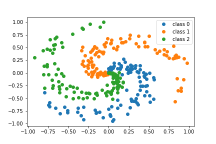
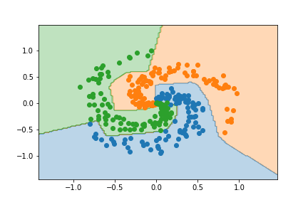

# Neural Networks for Classification

 

## Jupyter notebooks
- [Intro to Object Oriented Programming](https://nbviewer.jupyter.org/github/um-perez-alvaro/Data-Science-Theory/blob/master/Jupyter%20Notebooks/Neural%20Nets/notebooks/Intro%20to%20Object%20Oriented%20Programming.ipynb)
- [Adding Layers](https://nbviewer.jupyter.org/github/um-perez-alvaro/Data-Science-Theory/blob/master/Jupyter%20Notebooks/Neural%20Nets/notebooks/Adding%20Layers.ipynb)
- [Activation Functions](https://nbviewer.jupyter.org/github/um-perez-alvaro/Data-Science-Theory/blob/master/Jupyter%20Notebooks/Neural%20Nets/notebooks/Activation%20Functions.ipynb)
- [Categorical Cross-Entropy Loss Functions](https://nbviewer.jupyter.org/github/um-perez-alvaro/Data-Science-Theory/blob/master/Jupyter%20Notebooks/Neural%20Nets/notebooks/Categorical%20Cross-Entropy%20Loss%20Function.ipynb)
- [Backpropagation](https://nbviewer.jupyter.org/github/um-perez-alvaro/Data-Science-Theory/blob/master/Jupyter%20Notebooks/Neural%20Nets/notebooks/Backpropagation.ipynb)
- [Gradient Descent](https://nbviewer.jupyter.org/github/um-perez-alvaro/Data-Science-Theory/blob/master/Jupyter%20Notebooks/Neural%20Nets/notebooks/Stochastic%20Gradient%20Descent.ipynb)
- [Example](https://nbviewer.jupyter.org/github/um-perez-alvaro/Data-Science-Theory/blob/master/Jupyter%20Notebooks/Neural%20Nets/notebooks/Three%20Spirals%20Dataset.ipynb)

## Homework Assignment 8 ()

- [The MNIST dataset revisited]()

## Datasets
Filename | Description |  Source
--- | --- |  --- 
