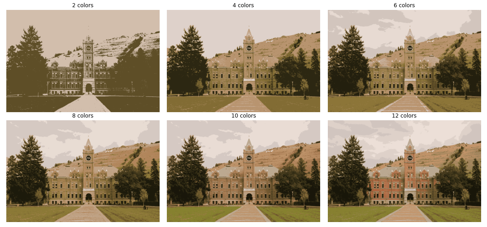

# Theoretical Data Analytics

## Contents:

- [Jupyter Notebooks, Numpy and Matplotlib](https://github.com/um-perez-alvaro/Data-Science-Theory/tree/master/Jupyter%20Notebooks/Jupyter%20Notebooks%2C%20numpy%20and%20matplotlib)
- [Linear Regression](https://github.com/um-perez-alvaro/Data-Science-Theory/tree/master/Jupyter%20Notebooks/Regression)
- [Optimization and Gradient Descent](https://github.com/um-perez-alvaro/Data-Science-Theory/tree/master/Jupyter%20Notebooks/Optimization%20and%20Gradient%20Descent)
- [Classification Algorithms](https://github.com/um-perez-alvaro/Data-Science-Theory/tree/master/Jupyter%20Notebooks/Classification%20algorithms)
- [Clustering Algorithms](https://github.com/um-perez-alvaro/Data-Science-Theory/tree/master/Jupyter%20Notebooks/Clustering%20algorithms)
- [Recommender Systems](https://github.com/um-perez-alvaro/Data-Science-Theory/tree/master/Jupyter%20Notebooks/Recommender%20Systems)
- [Neural Networks](https://github.com/um-perez-alvaro/Data-Science-Theory/tree/master/Jupyter%20Notebooks/Neural%20Nets)

## Projects

